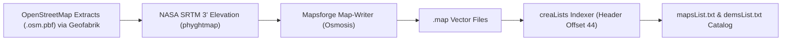

# 🗺️ A-GPS Tracker++ (Community) — Roadmap & Pending Work

This document tracks pending engineering tasks, architectural modernizations, and experimental outdoor gaming / GPS-art features.

> [!NOTE]
> **Completed milestones** have been removed from this file. For historical reference, see the commit log or the README.

---

## 🛠️ Part 1: Technical — Pending Phases

### Completed so far (reference)

| Milestone | Status |
|---|---|
| Clean Gradle build revival (API 34) | ✅ Done |
| Restore 192 missing XML layouts / drawables | ✅ Done |
| Mapsforge 0.25.0 upstream migration | ✅ Done |
| Blank tile hole fix + deadband GPS centering | ✅ Done |
| SFTP credentials decoupled (SOPS / build props) | ✅ Done |
| Community package ID + launcher badge | ✅ Done |
| Automated `build_release.sh` + GitHub Actions CI | ✅ Done |
| **Tech Milestone 2:** 445 maps + 14,295 DEMs → Archive.org | ✅ Done |
| **Tech Milestone 4:** Remaining distance (`Rem: XX.XX km`) on track follow | ✅ Done |
| **QA Milestone 1:** JUnit 4 + Mockito + Robolectric test harness | ✅ Done |
| **QA Milestone 2:** `onTaskRemoved` background location leak fix | ✅ Done |
| **QA Milestone 3:** Map rendering config (threads, GPU, label cache) | ✅ Done |
| **QA Milestone 4:** Robolectric Native Graphics visual tile render test | ✅ Done |

---

### Phase 1: Selective Core Deobfuscation ← **Next Priority**

* **Goal:** Demystify the active application logic without touching bulk third-party math/rendering code.
* **Scope (~30–50 files):**
  - **Foreground Tracking Service:** Refactor [`IntServLocGpsPP.java`](app/src/main/java/com/giobat/AgpsTrackerPP/IntServLocGpsPP.java) (rename obfuscated fields `f3566h`, `f3573p`, etc. to semantic names like `isTrackingActive`, `pendingServiceIntent`).
  - **Main Screen Controller:** Refactor [`MainActivity.java`](app/src/main/java/com/giobat/AgpsTrackerPP/MainActivity.java) map hooks and track recorders.
  - **DEM & Altitude Calculations:** Document and clean up NASA DEM elevation interpolation routines and geoid EGM96 offsets.
  - **GPX Exporter & Waypoint Manager:** Unify `.gpx` file reading/writing logic into standard models.
* **Token Budget:** ~1.5M–2.5M tokens across 1–2 focused sessions.

#### Decompiler Cross-Verification Strategy

| Tool | Role |
|---|---|
| **JADX** | Primary baseline — most readable. Weakness: can mangle complex CFG loops |
| **CFR** | Gold standard for loop/CFG fidelity — use to cross-validate suspicious `while` loops |
| **Fernflower** | Conservative, safe — prefers `while(true)+break` over synthetic `for` |
| **Procyon** | Best for Java 8 lambdas/streams/generics |

#### Decompilation Artifact Checklist (do for every refactored file)

- [ ] **Loop Increments:** Verify all `while`/`for` loops have explicit `i++` to prevent ANRs.
- [ ] **Branch Inversion:** Watch for inverted `continue` conditions (`< min` vs `>= min`).
- [ ] **Lock Scopes:** Ensure `requestRedraw()` / `invalidate()` run *outside* semaphore/mutex scopes.
- [ ] **Regression Tests First:** Pair every deobfuscation session with unit/visual tests using real GPX tracks.

---

### Phase 2: Remaining Server Independence Tasks

**Archive.org migration is complete** (445 maps + 14,295 DEMs). The following zero-cost options remain unevaluated:

- [ ] **Option C — Direct OpenAndroMaps integration (0 €):** Point in-app map downloader to community catalogs (OpenAndroMaps / Freizeitkarte) for actively-updated hiking maps worldwide.
- [ ] **Option D — Public NASA/USGS DEM mirrors (0 €):** Route elevation tile requests directly to NASA Earthdata, USGS 3DEP, Viewfinder Panoramas, or OpenTopography instead of private SFTP.
- [ ] **Option E — On-the-fly map & relief generation:**
  - *Client-side dynamic relief:* Load clean base vector map + apply dynamic hillshading from live NASA `.hgt` tiles.
  - *On-the-fly area compiler:* GitHub Actions pipeline → OSM extract (Geofabrik) + NASA SRTM → lightweight `.map` for any custom bounding box.

---

### Phase 3: Android Lifecycle Modernization

- [ ] Migrate legacy SDK compatibility shims to Android 14+ background location permission flows (`ACCESS_FINE_LOCATION`, `ACCESS_BACKGROUND_LOCATION`, notification channels).
- [ ] Optional: gradual Kotlin adoption for new modules and extensions.

---

## 📌 Pending Tech Milestones

### Tech Milestone 1: Core Deobfuscation

- [ ] Rename obfuscated fields in `IntServLocGpsPP` and `MainActivity` to semantic English names.
- [ ] Add unit tests covering the deobfuscated logic before and after renaming.

### Tech Milestone 2: Public DEM Mirror Routing

- [ ] Route DEM tile requests to NASA Earthdata / USGS / Viewfinder Panoramas.
- [ ] Evaluate dynamic on-the-fly relief as an alternative to static pre-generated archives.

### Tech Milestone 3: Internationalization & Translation (i18n)

- [ ] Audit and standardize English base strings (`values/strings.xml`).
- [ ] Clean up decompiler string artifacts (garbage variable-name strings).
- [ ] Complete Spanish (`values-es`) and Italian (`values-it`) translations across all layouts, menus, and alert dialogs.

### Tech Milestone 4: Map Coverage & Rendering Fixes

> See [`TODO_THECH.md`](TODO_THECH.md) for full root cause analysis.

- [ ] **Viewport-intersection map loading (`m2.java:b`):** Load all `.map` files whose `BoundingBox` intersects the visible viewport (not just contains the center point) to fix blank tiles when zooming out.
- [ ] **Dynamic zoom level clamping:** Read `zoomLevelMin`/`zoomLevelMax` from each `.map` header (offset 44+) and apply them to `MapView` to prevent navigation beyond tile coverage.
- [ ] **`InMemoryTileCache` capacity review (`m2.java:245`):** Recalculate tile cache capacity for modern HiDPI screens (30–50 simultaneous tiles vs. 10–15 on older 720p devices).

---

## 🐛 Known Bugs

- [ ] **Double-tap to import route does not trigger:** The double-tap gesture on a route/file in the file browser does not fire the import action. Review `GestureDetector` and ensure `onDoubleTap` is wired to the route loading flow.
- [ ] **Elevation profile downsampling for long routes (deferred):** For routes >10,000 points, `GraphView` allocates thousands of `DataPoint` objects on the UI thread causing jank. Implement Ramer–Douglas–Peucker or fixed decimation (~500–1,000 representative points).

---

## 🗺️ Reference: How Giorgio Compiled the Maps

We reverse-engineered Giorgio's tools and files from his server (`agps-tracker.cloud/readme` + `creaLists.jar`):



#### Map Compilation Steps

1. Download regional `.osm.pbf` extracts from [Geofabrik](https://download.geofabrik.de/).
2. Generate 10m/20m contours with [`phyghtmap`](http://katze.tfiu.de/projects/phyghtmap/) from NASA SRTM / Copernicus DEM.
3. Compile to Mapsforge binary:
   ```bash
   osmosis \
     --read-pbf file="region-with-contours.osm.pbf" \
     --mapfile-writer file="region.map" \
     type=hd tag-conf-file=tag-mapping.xml \
     bbox=minLat,minLon,maxLat,maxLon
   ```

#### Catalog Generator (`creaLists.jar` reverse-engineered)

- Opens each `.map` as `RandomAccessFile`, seeks to **byte offset 44**, reads 4× 32-bit big-endian ints (microdegrees / 1,000,000):
  `minLat · minLon · maxLat · maxLon`
- Modern Python replacement (`build_catalog.py`):
  ```python
  import struct, os

  def index_maps(root_dir, output_file):
      with open(output_file, 'w') as out:
          for dirpath, _, filenames in os.walk(root_dir):
              for f in filenames:
                  if f.endswith('.map'):
                      full_path = os.path.join(dirpath, f)
                      rel_path = "./" + os.path.relpath(full_path, root_dir)
                      size = os.path.getsize(full_path)
                      with open(full_path, 'rb') as raf:
                          raf.seek(44)
                          minlat, minlon, maxlat, maxlon = struct.unpack('>iiii', raf.read(16))
                          out.write(f"{rel_path},{minlat/1e6},{minlon/1e6},{maxlat/1e6},{maxlon/1e6},{size}\n")
  ```

#### NASA DEM Sources

| Source | URL |
|---|---|
| USGS EarthExplorer / NASA Earthdata | https://earthexplorer.usgs.gov/ |
| Viewfinder Panoramas (Jonathan de Ferranti) | http://viewfinderpanoramas.org/ |
| Derek Watkins' SRTM Tile Grabber | https://dwtkns.com/srtm30m/ |

---

## 💡 Part 2: Creative Concepts (Future Evolution Forks)

> [!NOTE]
> To keep this repository as the **rock-solid, stable community revival**, experimental concepts (Tron, Mazes, P2P gaming) will be developed in dedicated forks.

### 1. ✍️ GPS Route Art / "Draw with Your Steps"

- [ ] **Creative Milestone 1:** Ghost guide overlay for tracing shapes on real maps.
- Ghost guide overlay, vector stroke smoothing, art export (SVG/GPX/PNG), message reveal mode.

### 2. 🏍️ Outdoor Tron Lightcycle Challenge

- [ ] **Creative Milestone 3a:** Persistent colored GPS "light wall" trail per player.
- Real-time collision rules, dynamic shrinking boundary, audio/vibration feedback.

### 3. 🧩 Outdoor GPS Labyrinths & Time Attack

- [ ] **Creative Milestone 3b:** Procedural virtual maze overlaid over outdoor space.
- Virtual walls, Fog of War mode, community leaderboards, QR code maze sharing.

### 4. 🌐 Decentralized P2P Networking (P2PT)

- [ ] **Creative Milestone 2:** Serverless peer-to-peer position exchange for multiplayer modes.
- WebTorrent trackers + WebRTC data channels, zero server infrastructure, offline BLE fallback.

---

## 🧪 Part 3: Testing — Pending Items

> [!TIP]
> Run existing tests with: `./gradlew testDebugUnitTest`

### Pending Unit Tests (JVM / JUnit 4 + Mockito)

- [ ] **GPX Parser & Exporter Tests:**
  - Parse `.gpx` files with waypoints, routes, and tracks.
  - Export validation against GPX 1.1 XML schema.
  - Corrupted / incomplete data handling.
- [ ] **Geometry & Map Algorithms (`BoundingBox` & coordinates):**
  - Geodesic distance formulas (Haversine vs Vincenty).
  - Viewport ↔ `.map` `BoundingBox` intersection.
  - WGS84 ↔ Mapsforge tile X/Y/Zoom conversion.
- [ ] **DEM Elevation & Interpolation:**
  - Bilinear interpolation of HGT grids (NASA SRTMGL3).
  - EGM96 geoid undulation correction on ellipsoidal heights.
- [ ] **Thread Pool & Cache Configuration:**
  - Adaptive thread count in `MapWorkerPool` vs available CPU cores.
  - `InMemoryTileCache` eviction policy validation.

### Pending Android Component Tests (Robolectric)

- [ ] **Location Service Lifecycle (`IntServLocGpsPP`):**
  - `onStartCommand` creates notification channel + foreground notification.
  - `onDestroy()` calls `removeLocationUpdates()` and nulls static references.
  - `onTaskRemoved()` stops service when `REC_ON == false`.
  - Service survives app swipe when `REC_ON == true` (track not lost).
- [ ] **BroadcastReceivers & Notification Intents:**
  - Simulate boot intents and recording control commands.

### Pending UI / Integration Tests (Espresso — requires emulator)

- [ ] **Exit flow:** Menu → "Salir" → Confirm → activity finishes, service stops.
- [ ] **Render settings:** Open render settings → pick thread count → save → UI reflects change.
- [ ] **Map selector dialog:** Browse local maps, activate/deactivate layers.
- [ ] **Recording flow:** Rec button → UI in recording mode → Stop → GPX saved.

---

## 📋 Full Pending Milestones Summary

### 🔧 Track A: Technical
- [ ] **Tech Milestone 1:** Core deobfuscation (`IntServLocGpsPP` + `MainActivity`)
- [ ] **Tech Milestone 2:** Public DEM mirror routing (NASA Earthdata / USGS / Viewfinder)
- [ ] **Tech Milestone 3:** i18n audit — English base strings + ES + IT translations
- [ ] **Tech Milestone 4:** Map coverage & rendering fixes (viewport intersection, dynamic zoom clamping, tile cache capacity)

### 🐛 Known Bugs
- [ ] Double-tap to import route does not trigger
- [ ] Elevation profile downsampling for long routes (>10,000 pts) — deferred

### 🎨 Track B: Creative (Future Forks)
- [ ] **Creative Milestone 1:** GPS Route Art overlay & GPX stroke smoother
- [ ] **Creative Milestone 2:** Serverless P2P networking bridge (P2PT / WebRTC)
- [ ] **Creative Milestone 3:** Outdoor Tron Lightcycle & GPS Maze prototypes

### 🛡️ Track C: Quality & Testing
- [ ] **QA Milestone 5:** Comprehensive GPX parser + DEM elevation unit test suite
- [ ] **QA Milestone 6:** Espresso UI smoke test suite for core user journeys
