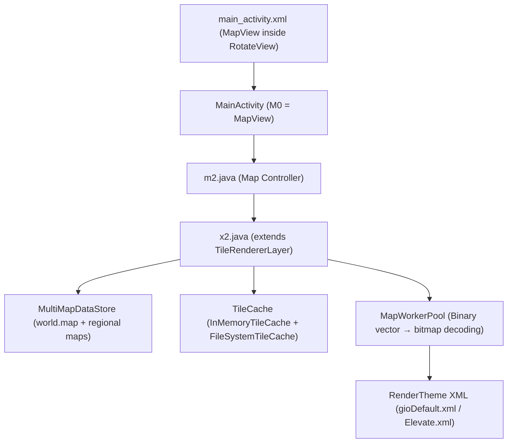

# 🛠️ Map Rendering — Technical Analysis & Pending Tasks

This document contains the detailed technical analysis of the current map tile rendering pipeline in **A-GPS Tracker++**, the root causes of observed anomalies (blank tiles on zoom change, performance vs. the original app), and the list of pending technical tasks.

---

## 🔍 1. Rendering Pipeline Diagram

### Key Components
1. **Visual Container**: [`org.mapsforge.map.android.rotation.RotateView`](app/src/main/java/org/mapsforge/map/android/rotation/RotateView.java) hosts the `MapView` inside [`main_activity.xml`](app/src/main/res/layout/main_activity.xml#L24-L33).
2. **Coordinator**: [`c2/m2.java`](app/src/main/java/c2/m2.java) configures:
   - Rendering layer [`x2.java`](app/src/main/java/c2/x2.java) (`TileRendererLayer`).
   - Multi-map data store (`MultiMapDataStore`).
   - Combined in-memory + disk cache (`TwoLevelTileCache`).
3. **Render Engine**: Mapsforge divides the viewport into a tile grid using `DisplayModel`, enqueuing work to `MapWorkerPool` to rasterize binary vectors to bitmaps using the [`gioDefault.xml`](app/src/main/assets/gioDefault.xml) theme.

---

## ⚠️ 2. Root Cause Analysis

### A. Blank tiles when zooming out
1. **Center-point-only map filter (`m2.java:432–445`):**
   - In `m2.b(LatLong centerPoint, ...)`, the app scans `Maps/` and only adds maps whose `BoundingBox` **contains exactly the screen center point** (`centerPoint`).
   - When zooming out, the visible surface multiplies. Maps adjacent to the center are never added to the `MultiMapDataStore`, leaving neighbouring regions blank.
2. **Insufficient `world.map` base layer (`res/raw/world.map`):**
   - The embedded base map (~3.2 MB) only provides simplified geometry for global zoom levels (0–5). At intermediate zooms (7–11), it cannot fill tiles not covered by the regional map.
3. **Zoom level ceiling of `.map` files:**
   - Mapsforge `.map` files are compiled with a maximum zoom (typically 16–18). Since `MapView` allows zoom up to 20 (`setZoomLevelMax(20)`), tiles beyond the file's max zoom level have no vector data available.

### B. Performance vs. the original app (context, already resolved)
- Multi-threading, GPU acceleration, and label caching were the bottlenecks. All three have been resolved — see the completed milestones table in `TODO.md`.

---

## 📋 3. Pending Tasks

### Phase 2: Coverage & Zoom Fixes

- [ ] **Viewport-intersection map loading (`m2.java:b`):**
  Change the map query to check if a map's `BoundingBox` **intersects** the visible viewport `BoundingBox` (instead of just containing the center point). Alternative: load all maps in the `Maps/` folder unconditionally into `MultiMapDataStore`.

- [ ] **Dynamic zoom level clamping:**
  Read `zoomLevelMin` / `zoomLevelMax` from the active `.map` file's binary header (offset 44+) and call `setZoomLevelMax` / `setZoomLevelMin` accordingly, preventing the user from navigating to zoom levels with no tile coverage.

- [ ] **`InMemoryTileCache` capacity formula review (`m2.java:245`):**
  Adjust the tile cache size calculation to account for modern HiDPI screen densities (30–50 simultaneous tiles on 1080p+ vs. 10–15 on older 720p screens) to avoid premature tile eviction.

---

## 🐛 Pending Bugs

- [ ] **Double-tap to import route does not trigger:**
  The double-tap gesture on a route/file in the file browser does not fire the expected import action. Review the `GestureDetector` setup and ensure `onDoubleTap` is correctly wired to the route loading flow.

- [ ] **Elevation profile downsampling for long routes (Option C — deferred):**
  For long routes with thousands of points (e.g. >10,000 pts), `GraphView` renders on the UI thread and allocates thousands of `DataPoint` objects, causing jank. Implement a point simplification algorithm (Ramer–Douglas–Peucker or decimation to ~500–1,000 representative points) to speed up drawing and reduce memory pressure on the graph view.

---

## ✅ Resolved (reference)

| Issue | Resolution |
|---|---|
| Single-threaded `MapWorkerPool` | Adaptive multi-thread via `MapRenderPreferences` |
| Software rendering (`setLayerType(1)`) | GPU acceleration toggle in settings |
| Label cache disabled | `cacheLabels = true` by default in `x2.java` |
| Mapsforge 0.25.0 migration | Complete — upstream libs, `Region.Op.DIFFERENCE` patch, `SPEED` parent tiles |
| Route photo: thumbnail visible but full image not shown | `FLAG_GRANT_READ_URI_PERMISSION` + safe `inSampleSize` decode |
| Remaining distance UI block position | `Rem: XX.XX km` placed at top of altitude block in `label1` |
| ANR in elevation profile (`GraphView`) | JADX decompilation infinite loops fixed; zero-division guard added; validated with Rivas GPX |
